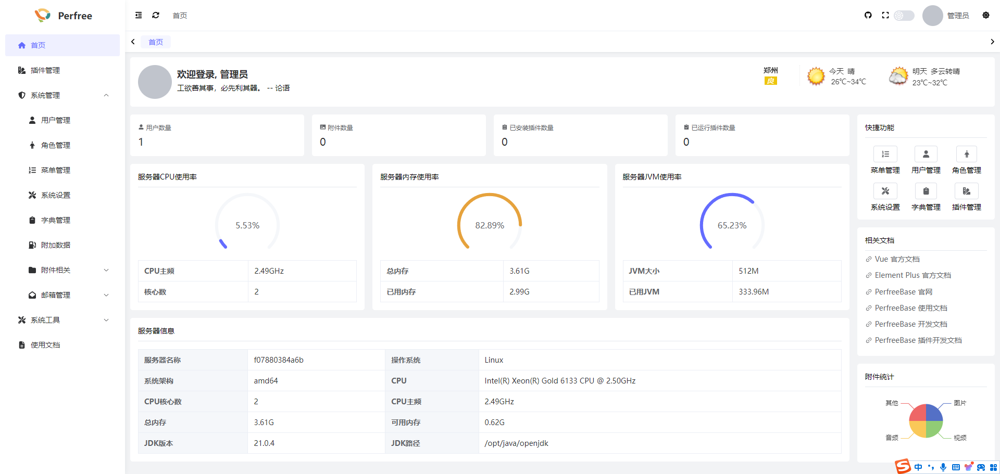

# perfree-base
一个新架子,前后端支持插件化动态插拔的后台管理模板, 文档正在加急编写中...

## 功能简介
* 设计简洁，界面美观
* 前后端支持插件动态化开发,生产环境动态插拔
* 支持系统/插件代码生成
* 支持加载动态权限菜单，按钮级别权限控制
* ......

## 技术栈
以下包含了所使用到的技术栈及开发环境版本

| 名称           | 版本     |
|--------------|--------|
| JDK          | \>=17  |
| mysql        | 8.0.21 |
| mybatis-plus | 3.5.6  |
| security     | 6.2.1  |
| vue          | 3.4.29 |
| element plus | 2.7.7  |

## 预览图

